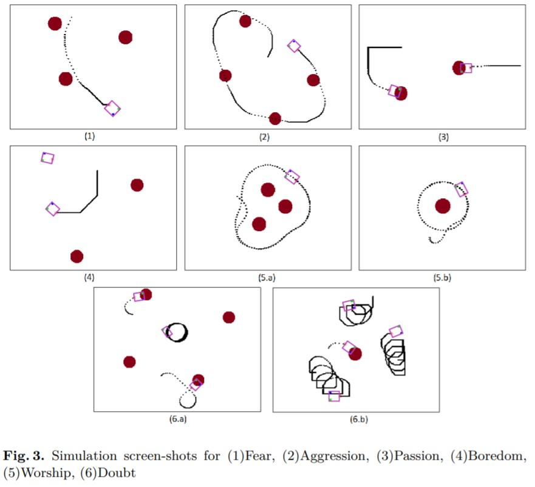

# Fuzzy Logic of Quantum Braitenberg Vehicles
This repository builds a computer simulation to observe the fuzzy logic behavior of quantum controlled Braitenberg vehicles. Braitenberg vehicles were an early thought experiment in cybernetics conceived by Valentino Braitenberg, and a brief introduction to them can be found [here](https://en.wikipedia.org/wiki/Braitenberg_vehicle). The observations from the above simulation were accepted in the 11th International Conference on Quantum Interaction (QI2018), a copy of which can be found [here](https://hal-centralesupelec.archives-ouvertes.fr/hal-01839282/file/QI_2018_QBV-fuzzy-robot-paper_HAL.pdf). Kindly cite the source if you use the code as follows:

`Rebeca Araripe Furtado Cunha, Naman Sharma, Zeno Toffano, François Dubois. Fuzzy Logic Behavior of Quantum-Controlled Braitenberg Vehicle Agents. 11th International Conference on Quantum
Interaction (QI2018), Sep 2018, Nice, France. ffhal-01839282f`

## Running the Code
There is a pre-compiled `Quantum_BV.jar` file availalbe to run the simulation without needing the JDK. To run the simulation, simply execute the following command:

`java -jar Quantum_BV.jar`

Some instructions for running the simulation:
 - Right click adds a new vehicle with a random angle of initial movement.
 - Left click adds a "light" source.
 - Any new car added has the quantum gates currently selected from the drop down menus. Any changes made in the selection only affect the future vehicles added to the screen.
 - The window includes a CLEAR button to clear the screen and begin again.
 - The screen is thought of as a continous canvas, and a vehicle dissapearing on the right side returns from the left. Another option is to have a "bounce wall" where if a car hits the boundary it is reflected back. This option is currently commented out in the function `changePosition()` of `Vehicle.java`.

If required, any changes made to the code can be recomplied into a `.jar` file by executing:

`jar cfmv Quantum_BV.jar bin/manifest.txt bin/*.class`

## Some Results
The figure below shows some results that we were able to achieve using the simulation.

To get the same results from the simulation, use the table below to initialize the vehicles.

|   Emotion   |   Left Matrix   |   Right Matrix  |
|:-----------:|:---------------:|:---------------:|
|     Fear    |        A        |        B        |
| Aggresssion |        B        |        A        |
|   Passion   | B not implies A | A not implies B |
|   Boredom   | A not implies B | B not implies A |
|   Worship   |        HH       |        B        |
|    Doubt    | B not implies A |       XOR       |